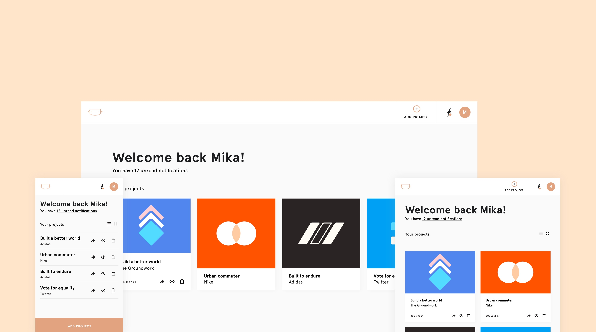
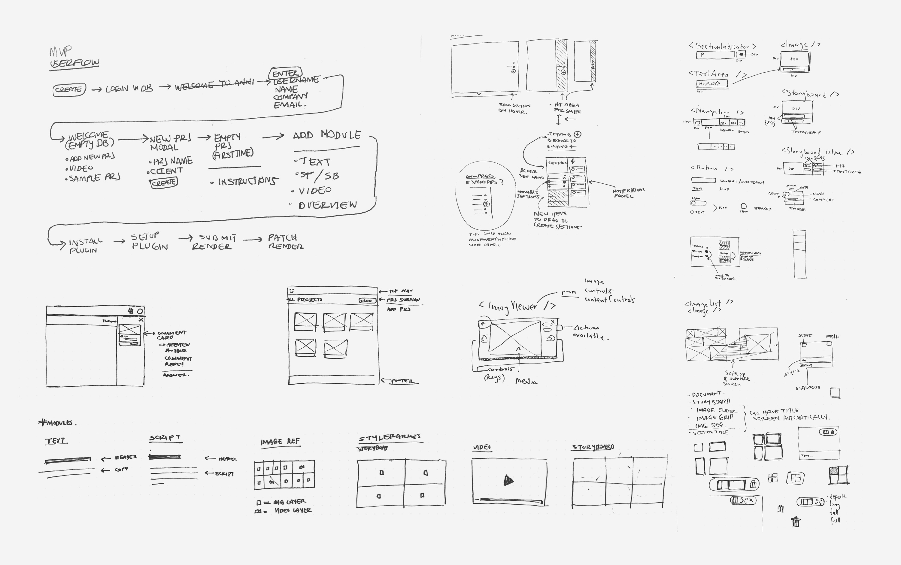
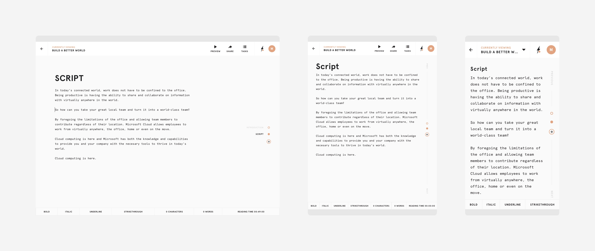
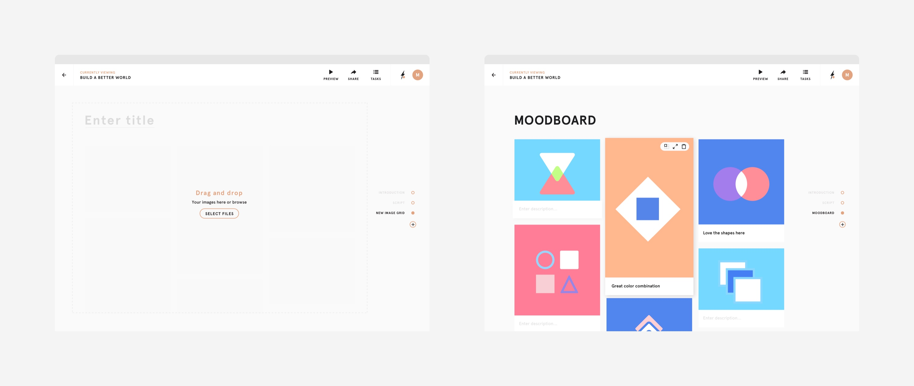
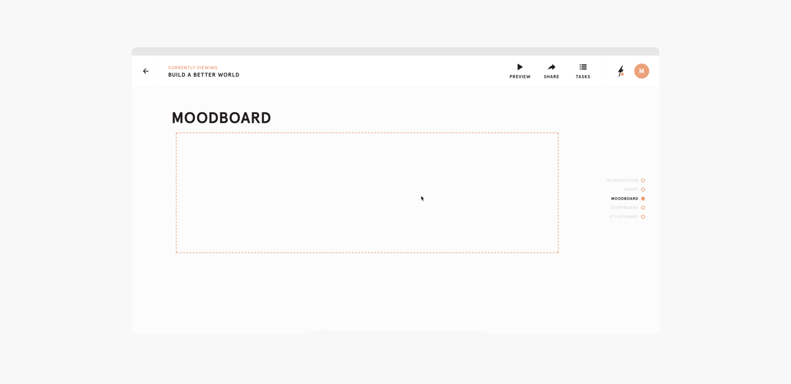
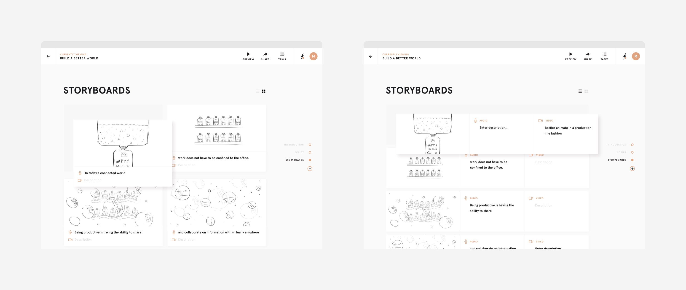
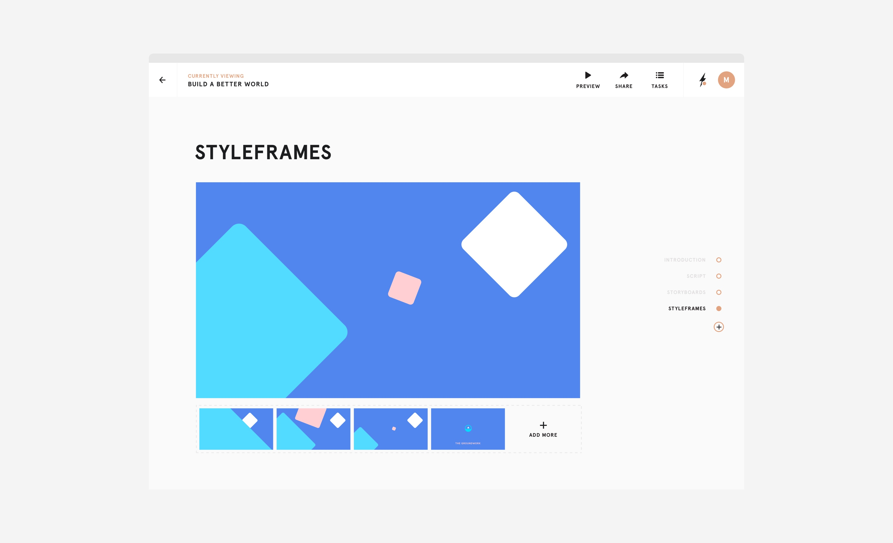

One of the biggest points of feedback I received from users during the initial research phase was the pain of adding a new tool to their workflow. As a result, Anni will consolidate their current toolset, instead of adding another one. No more Google docs, PDFs and feedback-filled emails, now they can deal with these and more in a single space.

The text editor includes all relevant functionality needed for script-writing, without the extra bulk of tools like Google Docs or Word.

One of the most desired features was the ability to quickly put together animated moodboards that can easily convey the aesthetic and animation style of an animation.

The storyboard editor features both a traditional pane-based design as well as an Audio/Video format. This flexibility allows users to easily organize and annotate their storyboards with ease.

The styleframe editor allows users to easily put together slideshows of their styleframes, a common item in an animation pitch deliverable that conveys the final aesthetic look of an animation.

