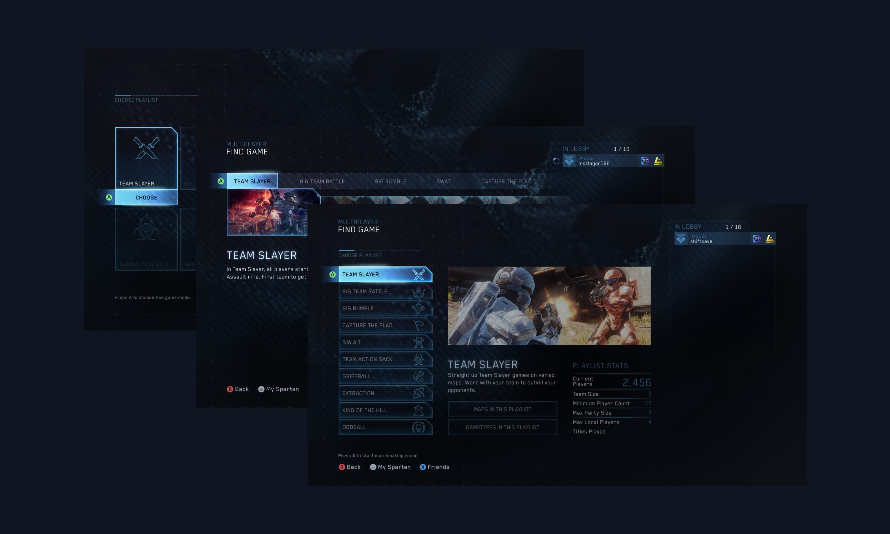
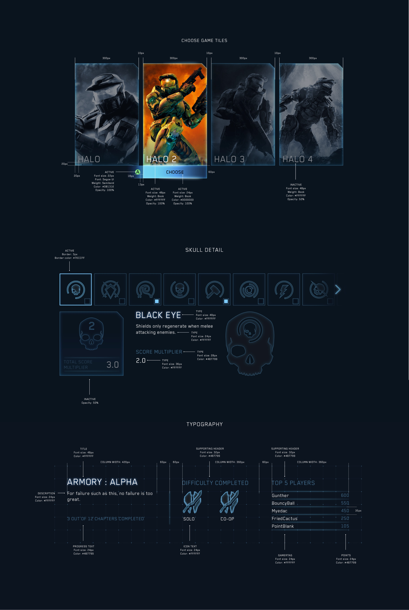

`vimeo:https://vimeo.com/193181220`

To address the fast-paced nature of this project I implemented a design workflow that allowed us to deliver pixel-perfect animated prototypes to be tested on a weekly basis, in order to allow us to validate and iterate our design solutions.

`vimeo:https://vimeo.com/193181256`

Once approved, we developed design and animation guidelines early on that could be implemented in development whilst still working on the rest of the gameplay experience.

